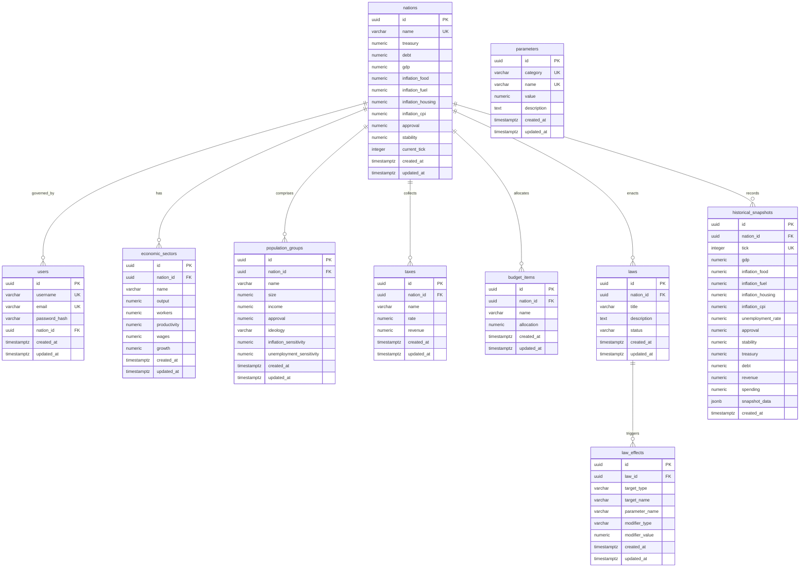

# WORLDr Database Schema - Phase 1 Design

This document details the PostgreSQL database schema design for Phase 1 of WORLDr.

## Architecture & Design Decisions

### 1. Multi-Nation Scalability
Each entity (sectors, population groups, taxes, budgets, laws) is linked via a foreign key `nation_id` referencing the `nations` table. This allows the system to easily support multiple nations concurrently in subsequent phases without structural migrations.

### 2. Multi-Player Governance
The relationship between `users` and `nations` is represented by an optional `nation_id` on the `users` table. This design supports:
- Single-player gameplay.
- Multiplayer co-op gameplay (multiple users assigned to the same `nation_id`).
- Spectator/unassigned mode (users with `nation_id IS NULL`).

### 3. Normalization vs. Extensibility
Rather than storing economic sectors or population groups as columns in the `nations` table, they are normalized into separate tables (`economic_sectors`, `population_groups`, `taxes`, and `budget_items`). This keeps the schema clean, enforces numeric constraints, and allows adding new sectors, taxes, or spending categories dynamically.

### 4. Deterministic Laws and Modifiers
To support complex gameplay rules without hardcoded values, the schema separates `laws` from their actual numerical impact:
- `laws` represent policies that can be passed, proposed, or repealed.
- `law_effects` contain concrete multipliers or additives targeting specific sectors, population groups, or taxes. 
- During simulation ticks, the backend queries active laws and their effects to dynamically scale base parameters.

### 5. Efficient Historical Snapshots
Storing a separate row in each normalized sub-table per nation per month would lead to massive database bloat (e.g., 5 sectors + 5 classes + 5 taxes + 5 budgets = 20 rows per nation per month; 1,000 players over 10 years = 2.4 million rows). 
- **Solution**: The `historical_snapshots` table stores core tracking parameters as standard table columns for fast querying and indexing.
- Deep, granular subsystem states are saved in a highly compressed `snapshot_data` `JSONB` column. This keeps queries for historical charts extremely fast while avoiding excessive database growth.

---

## Entity-Relationship Diagram

---

## Detailed Data Dictionary

### 1. `nations`
Holds the core live state of simulated nation states.

| Column | Type | Constraints | Description |
| :--- | :--- | :--- | :--- |
| `id` | `UUID` | `PRIMARY KEY`, `DEFAULT gen_random_uuid()` | Unique nation identifier. |
| `name` | `VARCHAR(100)` | `UNIQUE`, `NOT NULL` | Name of the nation. |
| `treasury` | `NUMERIC(20,2)`| `NOT NULL`, `DEFAULT 1000000000.00` | Current reserve cash balance. |
| `debt` | `NUMERIC(20,2)`| `NOT NULL`, `DEFAULT 0.00` | Accumulated national debt. |
| `gdp` | `NUMERIC(20,2)`| `NOT NULL`, `DEFAULT 0.00` | Latest calculated Gross Domestic Product. |
| `inflation_food` | `NUMERIC(5,4)` | `NOT NULL`, `DEFAULT 0.0200` | Sector inflation rate for food. |
| `inflation_fuel` | `NUMERIC(5,4)` | `NOT NULL`, `DEFAULT 0.0200` | Sector inflation rate for fuel/energy. |
| `inflation_housing`| `NUMERIC(5,4)` | `NOT NULL`, `DEFAULT 0.0200` | Sector inflation rate for housing. |
| `inflation_cpi` | `NUMERIC(5,4)` | `NOT NULL`, `DEFAULT 0.0200` | Weighted Consumer Price Index inflation. |
| `approval` | `NUMERIC(5,4)` | `NOT NULL`, `DEFAULT 0.5000`, `[0.0, 1.0]` | Aggregated popular approval rating. |
| `stability` | `NUMERIC(5,4)` | `NOT NULL`, `DEFAULT 0.5000`, `[0.0, 1.0]` | General country stability rating. |
| `current_tick` | `INTEGER` | `NOT NULL`, `DEFAULT 0`, `>= 0` | Total monthly ticks elapsed. |
| `created_at` | `TIMESTAMPTZ` | `NOT NULL`, `DEFAULT NOW()` | Date of nation creation. |
| `updated_at` | `TIMESTAMPTZ` | `NOT NULL`, `DEFAULT NOW()` | Timestamp of last modification. |

### 2. `users`
Tracks registered user credentials and active nation assignments.

| Column | Type | Constraints | Description |
| :--- | :--- | :--- | :--- |
| `id` | `UUID` | `PRIMARY KEY`, `DEFAULT gen_random_uuid()` | Unique user identifier. |
| `username` | `VARCHAR(50)` | `UNIQUE`, `NOT NULL` | User handle. |
| `email` | `VARCHAR(255)`| `UNIQUE`, `NOT NULL` | User email address. |
| `password_hash`| `VARCHAR(255)`| `NOT NULL` | Secure password hash. |
| `nation_id` | `UUID` | `REFERENCES nations(id)`, `SET NULL` | Linked nation governed by user. |
| `created_at` | `TIMESTAMPTZ` | `NOT NULL`, `DEFAULT NOW()` | Timestamp of registration. |
| `updated_at` | `TIMESTAMPTZ` | `NOT NULL`, `DEFAULT NOW()` | Timestamp of last modification. |

### 3. `economic_sectors`
Contains data regarding output, wages, and workers per sector.

| Column | Type | Constraints | Description |
| :--- | :--- | :--- | :--- |
| `id` | `UUID` | `PRIMARY KEY`, `DEFAULT gen_random_uuid()` | Unique identifier. |
| `nation_id` | `UUID` | `REFERENCES nations(id)`, `CASCADE` | Linked nation state. |
| `name` | `VARCHAR(50)` | `NOT NULL`, `CHECK IN(...)` | Sector name (Agriculture, Industry, Services, Energy, Construction). |
| `output` | `NUMERIC(20,2)`| `NOT NULL`, `DEFAULT 0.00` | Output value produced in latest tick. |
| `workers` | `NUMERIC(20,2)`| `NOT NULL`, `DEFAULT 0.00` | Total laborers employed. |
| `productivity` | `NUMERIC(10,4)`| `NOT NULL`, `DEFAULT 1.0000` | Productivity modifier index. |
| `wages` | `NUMERIC(20,2)`| `NOT NULL`, `DEFAULT 0.00` | Average wage in this sector. |
| `growth` | `NUMERIC(10,6)`| `NOT NULL`, `DEFAULT 0.000000` | Monthly growth rate. |
| `created_at` | `TIMESTAMPTZ` | `NOT NULL`, `DEFAULT NOW()` | Timestamp of creation. |
| `updated_at` | `TIMESTAMPTZ` | `NOT NULL`, `DEFAULT NOW()` | Timestamp of last modification. |

### 4. `population_groups`
Socio-economic classes and their statistics.

| Column | Type | Constraints | Description |
| :--- | :--- | :--- | :--- |
| `id` | `UUID` | `PRIMARY KEY`, `DEFAULT gen_random_uuid()` | Unique identifier. |
| `nation_id` | `UUID` | `REFERENCES nations(id)`, `CASCADE` | Linked nation state. |
| `name` | `VARCHAR(50)` | `NOT NULL`, `CHECK IN(...)` | Class name (Poor, Working, Middle, Wealthy, Elite). |
| `size` | `NUMERIC(20,2)`| `NOT NULL`, `DEFAULT 0.00` | Population count. |
| `income` | `NUMERIC(20,2)`| `NOT NULL`, `DEFAULT 0.00` | Mean per-capita income. |
| `approval` | `NUMERIC(5,4)` | `NOT NULL`, `DEFAULT 0.5000`, `[0.0, 1.0]` | Approval rating of government. |
| `ideology` | `VARCHAR(100)`| `NULL` | Dominant political ideology. |
| `inflation_sensitivity` | `NUMERIC(5,4)`| `NOT NULL`, `DEFAULT 0.5000` | Modifier representing inflation reaction severity. |
| `unemployment_sensitivity`| `NUMERIC(5,4)`| `NOT NULL`, `DEFAULT 0.5000` | Modifier representing unemployment reaction severity. |
| `created_at` | `TIMESTAMPTZ` | `NOT NULL`, `DEFAULT NOW()` | Timestamp of creation. |
| `updated_at` | `TIMESTAMPTZ` | `NOT NULL`, `DEFAULT NOW()` | Timestamp of last modification. |

### 5. `taxes`
Tax structures active in the nation.

| Column | Type | Constraints | Description |
| :--- | :--- | :--- | :--- |
| `id` | `UUID` | `PRIMARY KEY`, `DEFAULT gen_random_uuid()` | Unique identifier. |
| `nation_id` | `UUID` | `REFERENCES nations(id)`, `CASCADE` | Linked nation state. |
| `name` | `VARCHAR(50)` | `NOT NULL`, `CHECK IN(...)` | Tax name (Income Tax, Corporate Tax, Sales Tax, Property Tax, Tariffs). |
| `rate` | `NUMERIC(5,4)` | `NOT NULL`, `DEFAULT 0.1500`, `[0.0, 1.0]` | Current tax rate percentage. |
| `revenue` | `NUMERIC(20,2)`| `NOT NULL`, `DEFAULT 0.00` | Collected revenue in latest tick. |
| `created_at` | `TIMESTAMPTZ` | `NOT NULL`, `DEFAULT NOW()` | Timestamp of creation. |
| `updated_at` | `TIMESTAMPTZ` | `NOT NULL`, `DEFAULT NOW()` | Timestamp of last modification. |

### 6. `budget_items`
Government spending lines.

| Column | Type | Constraints | Description |
| :--- | :--- | :--- | :--- |
| `id` | `UUID` | `PRIMARY KEY`, `DEFAULT gen_random_uuid()` | Unique identifier. |
| `nation_id` | `UUID` | `REFERENCES nations(id)`, `CASCADE` | Linked nation state. |
| `name` | `VARCHAR(50)` | `NOT NULL`, `CHECK IN(...)` | Budget category (Education, Healthcare, Infrastructure, Welfare, Administration). |
| `allocation` | `NUMERIC(20,2)`| `NOT NULL`, `DEFAULT 0.00` | Monthly funding allocation. |
| `created_at` | `TIMESTAMPTZ` | `NOT NULL`, `DEFAULT NOW()` | Timestamp of creation. |
| `updated_at` | `TIMESTAMPTZ` | `NOT NULL`, `DEFAULT NOW()` | Timestamp of last modification. |

### 7. `laws`
Active or proposed legislative items.

| Column | Type | Constraints | Description |
| :--- | :--- | :--- | :--- |
| `id` | `UUID` | `PRIMARY KEY`, `DEFAULT gen_random_uuid()` | Unique identifier. |
| `nation_id` | `UUID` | `REFERENCES nations(id)`, `CASCADE` | Linked nation state. |
| `title` | `VARCHAR(255)`| `NOT NULL` | Short title of the law. |
| `description` | `TEXT` | `NULL` | Detailed explanation of policy. |
| `status` | `VARCHAR(50)` | `NOT NULL`, `DEFAULT 'passed'`, `CHECK IN(...)` | Status (passed, proposed, repealed). |
| `created_at` | `TIMESTAMPTZ` | `NOT NULL`, `DEFAULT NOW()` | Timestamp of law introduction. |
| `updated_at` | `TIMESTAMPTZ` | `NOT NULL`, `DEFAULT NOW()` | Timestamp of last modification. |

### 8. `law_effects`
Concrete modifiers associated with active laws.

| Column | Type | Constraints | Description |
| :--- | :--- | :--- | :--- |
| `id` | `UUID` | `PRIMARY KEY`, `DEFAULT gen_random_uuid()` | Unique identifier. |
| `law_id` | `UUID` | `REFERENCES laws(id)`, `CASCADE` | Parent law. |
| `target_type` | `VARCHAR(50)` | `NOT NULL`, `CHECK IN(...)` | Type of target (sector, population_group, tax, budget_item, nation). |
| `target_name` | `VARCHAR(100)`| `NOT NULL` | Exact name of target entity (e.g. 'Agriculture' or 'Poor'). |
| `parameter_name`| `VARCHAR(100)`| `NOT NULL` | Attribute modified (e.g. 'productivity', 'income', 'rate'). |
| `modifier_type` | `VARCHAR(20)` | `NOT NULL`, `CHECK IN(...)` | Modifier behavior (multiplier, additive). |
| `modifier_value`| `NUMERIC(10,6)`| `NOT NULL` | Value applied (e.g. multiplier: 1.05 = +5%; additive: 0.02 = +2%). |
| `created_at` | `TIMESTAMPTZ` | `NOT NULL`, `DEFAULT NOW()` | Timestamp of creation. |
| `updated_at` | `TIMESTAMPTZ` | `NOT NULL`, `DEFAULT NOW()` | Timestamp of last modification. |

### 9. `parameters`
System variables and base values for calculation tuning.

| Column | Type | Constraints | Description |
| :--- | :--- | :--- | :--- |
| `id` | `UUID` | `PRIMARY KEY`, `DEFAULT gen_random_uuid()` | Unique identifier. |
| `category` | `VARCHAR(50)` | `NOT NULL` | Category group (e.g. 'inflation', 'economy'). |
| `name` | `VARCHAR(100)`| `NOT NULL` | Unique parameter code (e.g. 'food_weight'). |
| `value` | `NUMERIC(20,6)`| `NOT NULL` | Standard value. |
| `description` | `TEXT` | `NULL` | Explanation of balancing effect. |
| `created_at` | `TIMESTAMPTZ` | `NOT NULL`, `DEFAULT NOW()` | Timestamp of creation. |
| `updated_at` | `TIMESTAMPTZ` | `NOT NULL`, `DEFAULT NOW()` | Timestamp of last modification. |

### 10. `historical_snapshots`
Monthly records storing previous states of simulated nations.

| Column | Type | Constraints | Description |
| :--- | :--- | :--- | :--- |
| `id` | `UUID` | `PRIMARY KEY`, `DEFAULT gen_random_uuid()` | Unique identifier. |
| `nation_id` | `UUID` | `REFERENCES nations(id)`, `CASCADE` | Linked nation state. |
| `tick` | `INTEGER` | `NOT NULL`, `CHECK (tick >= 0)` | Tick number index. |
| `gdp` | `NUMERIC(20,2)`| `NOT NULL` | Snapshot GDP. |
| `inflation_food` | `NUMERIC(5,4)` | `NOT NULL` | Snapshot food inflation. |
| `inflation_fuel` | `NUMERIC(5,4)` | `NOT NULL` | Snapshot fuel inflation. |
| `inflation_housing`| `NUMERIC(5,4)` | `NOT NULL` | Snapshot housing inflation. |
| `inflation_cpi` | `NUMERIC(5,4)` | `NOT NULL` | Snapshot CPI inflation. |
| `unemployment_rate`| `NUMERIC(5,4)` | `NOT NULL` | Snapshot general unemployment rate. |
| `approval` | `NUMERIC(5,4)` | `NOT NULL` | Snapshot approval rating. |
| `stability` | `NUMERIC(5,4)` | `NOT NULL` | Snapshot stability index. |
| `treasury` | `NUMERIC(20,2)`| `NOT NULL` | Snapshot treasury reserves. |
| `debt` | `NUMERIC(20,2)`| `NOT NULL` | Snapshot national debt. |
| `revenue` | `NUMERIC(20,2)`| `NOT NULL` | Snapshot monthly revenue. |
| `spending` | `NUMERIC(20,2)`| `NOT NULL` | Snapshot monthly expenses. |
| `snapshot_data` | `JSONB` | `NOT NULL` | Comprehensive payload capturing sector stats, class states, active policies, etc. |
| `created_at` | `TIMESTAMPTZ` | `NOT NULL`, `DEFAULT NOW()` | Date record was stored. |
