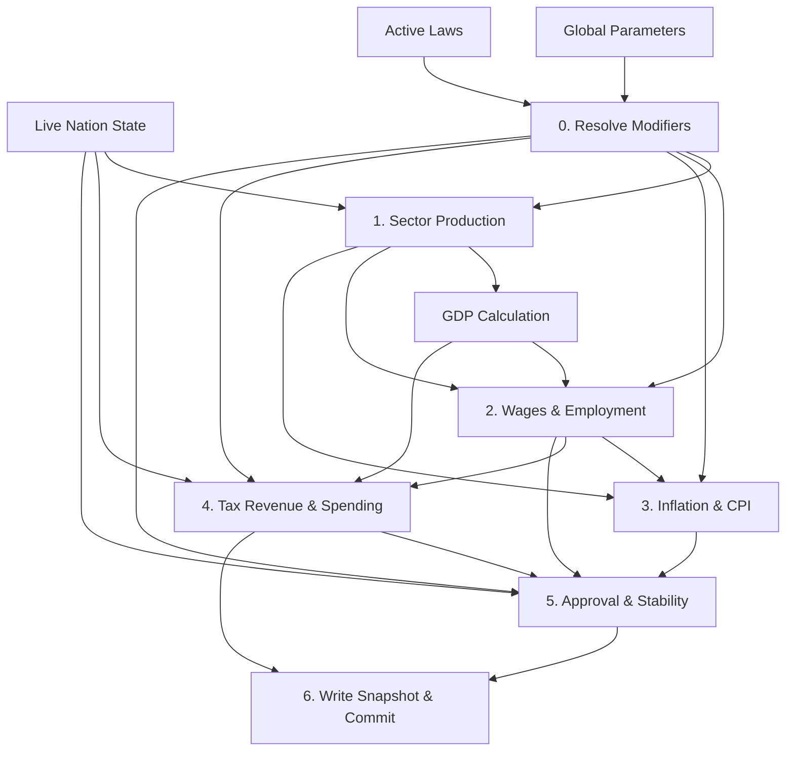

# WORLDr Simulation Tick - Update Order & Dependencies

This document outlines the execution pipeline, data dependencies, and flow chart of the monthly simulation tick in Phase 1 of WORLDr.

---

## 1. Dependency Graph

Calculation dependencies are strictly linear and forward-only to prevent feedback loops within a single tick.

---

## 2. Step-by-Step Update Sequence

| Step | Sub-System | Main Output Metrics | Calculations & Dependencies |
| :--- | :--- | :--- | :--- |
| **0** | **Modifier Resolver** | Parameter modifiers | Resolves active laws into additive and multiplicative modifiers on base values. |
| **1** | **Sector Production** | Sector `output`, national `gdp` | For each sector (Agriculture, Industry, etc.), outputs are computed using active workers, productivity indices, and modifiers. Summing these outputs yields the nation's new GDP. |
| **2** | **Wages & Labor** | Sector `wages`, national `unemployment_rate` | Adjusts sector employment sizes and average wages based on productivity. Compares total employment against the active labor force to determine the national unemployment rate. |
| **3** | **Inflation & CPI** | Sector price inflation, `inflation_cpi` | Calculates individual sector inflation (Food, Fuel, Housing) by evaluating output growth vs. demand. Aggregates these indices into the Consumer Price Index (CPI). |
| **4** | **Budget & Taxes** | Tax revenues, total expenses, `treasury`, `debt` | Computes tax collection (Income Tax, Sales Tax, etc.) based on new wages and outputs. Calculates budget allocations, updates the treasury, and manages deficit financing (debt creation). |
| **5** | **Approval & Stability** | Pop group `approval`, nation `approval`, `stability` | Updates population class satisfaction metrics based on real income, CPI spikes, and unemployment. Aggregates national approval and general stability. |
| **6** | **Finalize & Snapshot** | Saved tick index, DB commit, WS push | Increments `current_tick`, records a comprehensive JSONB state snapshot in `historical_snapshots`, and triggers live WebSocket events. |

---

## 3. Data Flow Specification

1. **Input Load Phase**:
   - Query DB for current nation parameters, sector stats, population classes, taxes, budget allocations, and active laws.
   - Fetch base parameters from Redis cache.

2. **In-Memory Transformation Pipeline**:
   - Output from **Step 1** (GDP, Sector Output) serves as input to **Step 2** (Labor wages/demand) and **Step 4** (Tax base calculation).
   - Sector outputs from **Step 1** and wages from **Step 2** serve as inputs to **Step 3** (Inflation/CPI calculation).
   - CPI from **Step 3**, unemployment from **Step 2**, and welfare spending from **Step 4** serve as inputs to **Step 5** (Approval & Stability).

3. **Output Persistence Phase**:
   - Modified fields are committed to Postgres in a single write operation.
   - Broadcast payload is dispatched to real-time WebSocket namespaces.
